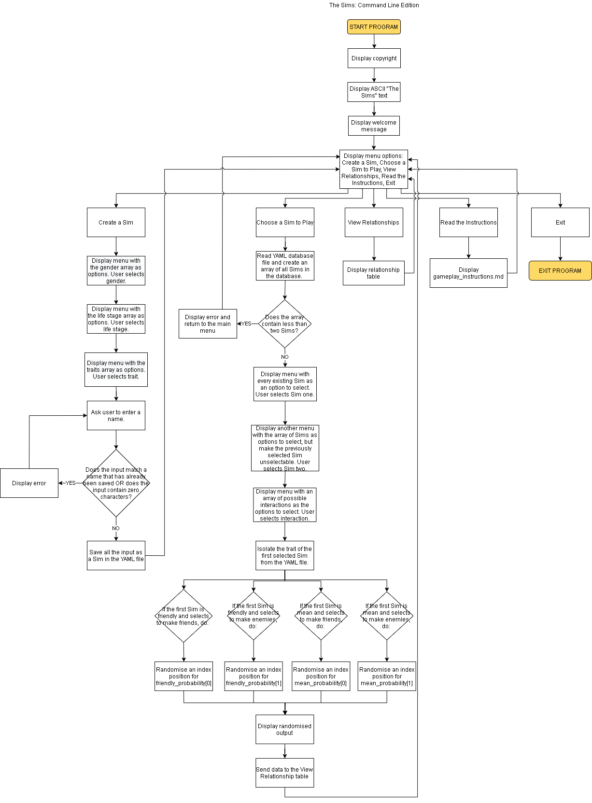

# The Sims: Command Line Edition

Github Repository: https://github.com/emigraced/EmilyMills_T1A3  

Guide: 
- [Purpose Statement](#Purpose-Statement)
- [Key Features](#Key-Features)
- [User Interaction and Experience](#User-Interaction-and-Experience)
- [Flowchart](#Flowchart)
- [Implementation Plan](#Implementation-Plan)
- [Help Documentation](#Help-Documentation)
- [Sources](#Sources)

---
## Purpose Statement

The purpose of this app is to bring a sense of nostalgia to the user by providing a selection of features from the popular 'The Sims' franchise. (It will be targetted towards those who are familiar with the game.)

The original franchise is a simulation game where users can create heavily customisable people ('Sims') and control their lives, including their moods, aspirations, relationships, living situations, and much more. 

This Ruby terminal app will allow users to create multiple Sims and specify their name, gender, stage of life, and a personality trait. The user can choose a Sim to 'play', and direct them to have certain interactions with other Sims. The key interest of the game is that the outcomes to these interactions have a chance of failing depending on the selected trait (friendly or mean) of the Sim in play. 

To further drive home the nostalgia, the app makes use of a few specific elements which nod to the original game: 
- ascii art with a diamond above the 'i' in 'Sims' (like the logo from The Sims 2),
- cyan colour (common colour across all the logos),
- a diamond selector in the menus (reminiscent of the plumbob).

This app reads and writes to a YAML database file, which serves as a library of Sims, and enables the game to be saved. When the user runs the app, their previously created Sims will still be available to them. 

TTY Prompt is a heavily utilised Gem in this app, and enables intuitive interaction from the user, who can easily flow through the game by making choices from the menus. A markdown file with gameplay instructions has also been made readily accessable from the home menu for users who require further guidance.

---
## Key Features

Throughout the following features, TTY Prompt is a significant element in the error handling process, because it limits the capacity for error by ensuring a valid response from the user. Methods, variables, and conditional control structures are also widely used throughout the code to enable a smooth user experience, and the interaction of different data elements.

### Sim Creation

Users can create as many Sims as they like (one at a time), and customise their gender, life stage, personality trait, and name. The creation process is presented to the user in a menu where they can make selections, and their selections are then saved to a YAML file, which serves as a library of created Sims. 

The Sim name creation is the only place where users can input data of their own accord (ie, not from a predetermined menu), and therefore the following extra error handling measures have been used: 
- Checking the user-provided name against the Sim library to ensure no double ups,
- Ensuring a response has been entered, so that the user cannot accidentally press enter and save a blank name. 

### Weighted Outcomes

Once two or more Sims have been created, the user can have some fun with interactions. One Sim can be selected to interact with a second Sim. The personality trait of the initiating Sim may have an effect on the outcome of the interaction. 

For example, if a mean-traited Sim tries to become friends with another Sim, there's a 40% chance that the interaction will fail because the Sim is mean, and they're not good at being friendly. Or if a friendly-traited Sim tries to make friends wih another Sim, their trait gives them the advantage of a 100% success rate. 

These weighted outcomes significantly add to the user's interest by adding an element of the unknown.

### View Relationships

Interaction outcomes (above) are sent to a table where they can be summarily displayed for users to clearly view the status of their Sims' relationships. The table has a row for each type of relationship (ie, friends or enemies), and the rows are populated with pairs of Sims (ie, the friends row might contain Sally & Priscilla).

---
## User Interaction and Experience

This app is very user friendly. Immediately available after app launch is an option to read the instructions. This document (a markdown file displayed using tty-markdown) outlines how the user can interact with the app, and what they might like to do.

All user interaction within the app (with the exception of naming Sims) is facilitated with the use of a menu, which eliminates the risk of the user entering invalid input, or not knowing what they're supposed to do next.

In the event of users trying to use certain features in the wrong order (ie, trying to initiate Sim interactions without having at least two Sims created, or trying to view the relationship status table before there is information to populate it), prompts are displayed to the user in yellow text which provide clear instructions as to the reason for the error, and what to do next. This allows for the smooth resumption of gameplay.

---
## Flowchart 

*This flowchart can also be accessed in the docs folder.*

---
## Implementation Plan 

I utilised a Trello board to outline my tasks and manage my time. You can [access it here](https://trello.com/b/TUebzU4P/term-1-terminal-project).

### Order of Priority

The app features have been ordered in the following priority:
1. Sim Creation
2. Weighted Outcomes
3. View Relationships

Weighted Outcomes is the feature which stands to provide the most interest to the user, but Sims first need to be created before this feature can be built, so Sim Creation takes first priority. View Relationships, then, comes third in the list.

Below, you will find an outline of how each feature will be implemented, accompanied by a checklist of tasks and a deadline.

### Sim Creation (DUE 12/12/2020)

- Enable the user to provide input,
- Streamline the user input process to limit errors,
- Determine how the created Sim data will be stored and accessed, 
- Utilise a YAML file to enable Sims to be saved even after exiting the app,
- Ensure no double ups in Sim names.

### Weighted Outcomes (DUE 15/12/2020)
- Allow user to select two Sims, 
- Find the trait of the initiating Sim,
- Use the trait data and the interaction (selected by the user) to determine the probability of the outcome,
- Create arrays for each probability type, and generate a random index position to determine the result,
- Display the randomised result to the user.

### View Relationships (DUE 18/12/2020)
- Save results when Sims interact with other Sims,
- Convert data to pairs of Sims categorised by relationship type,
- Send the data to a table, 
- Allow the table to be updated when further interactions occur,
- Make the table accessible to the user.

---
## Help Documentation

### Application Installation

### Dependancies

This app requires the following Ruby Gems, all of which are noted in the Gemfile:
- tty-prompt
- tty-markdown
- tty-color
- tty-table
- pastel

### System/hardware Requirements

This app was created and tested using Ubuntu on WSL, with Ruby version 2.7.1. No guarantees can be made for the performance of the app in other environments.

---
## Sources
- The Sims Video Games from Electronic Arts  
https://www.ea.com/en-au/games/the-sims
- Terminal Apps the Easy Way  
https://ttytoolkit.org/
- Are you making a CLI app? Use TTY::Prompt!  
https://medium.com/@ms.hernandeza1/are-you-making-a-cli-app-use-tty-prompt-2d483bd8823b
- Getting Started with RSpec  
https://semaphoreci.com/community/tutorials/getting-started-with-rspec
- Saving/Retrieving Data With a YAML file in Ruby: The Basics  
https://medium.com/@kristenfletcherwilde/saving-retrieving-data-with-a-yaml-file-in-ruby-the-basics-e45232903d94
